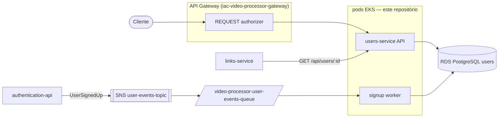

# users-service

API HTTP do domínio de **usuários (Profile)** do Tech Challenge FIAP X (Fase 5 — Hackathon, 13SOAT). Dono exclusivo da tabela `users` no RDS PostgreSQL (`name`, `email`, `document`), expõe leitura por posse-ou-admin e escrita administrativa, e roda um **worker reativo** que consome o evento `UserSignedUp` (SQS) — o único escritor de criação de perfil (ADR-012).

Repositório correspondente na organização: [`video-processor-users-api`](https://github.com/13SOAT-andromeda/video-processor-users-api).

---

## 1. Onde este serviço se encaixa na plataforma

Este é **só um dos microsserviços** da arquitetura descrita em `arquitetura-video-processing-tech-challenge.md`. A infraestrutura compartilhada vive em repositórios separados:

| Repositório | Responsabilidade | Relação com este serviço |
|---|---|---|
| [`iac-video-processor-data`](https://github.com/13SOAT-andromeda/iac-video-processor-data) | RDS (users) + DynamoDB (`auth-credentials`, `Links`, `LinkEvents`) | Provisiona o RDS PostgreSQL onde vive a tabela `users` |
| [`iac-video-processor-infra`](https://github.com/13SOAT-andromeda/iac-video-processor-infra) | VPC, EKS, ECR, filas/tópicos SNS/SQS, bucket S3 de vídeos, Ingress centralizado | Provisiona o ECR `video-processor-users-api-repo`, a fila `video-processor-user-events-queue` (consumida pelo worker) e o path `/users` no Ingress |
| [`iac-video-processor-gateway`](https://github.com/13SOAT-andromeda/iac-video-processor-gateway) | API Gateway HTTP API + REQUEST authorizer | Expõe `ANY /users` e `ANY /users/{proxy+}` atrás do authorizer, roteando via VPC Link para o pod deste serviço |
| `video-processor-authorizer` / `video-processor-authentication-api` | Login/signup (Lambda) + validação de JWT (Lambda) | O signup em `authentication` publica o evento `UserSignedUp` que este worker consome; aqui o JWT é só **validado** (mesmo segredo `jwt-signing-key`), nunca emitido |
| [`video-processor-link-api`](https://github.com/13SOAT-andromeda/video-processor-link-api) | Links de upload/download (DynamoDB) | Consome `GET /api/users/:id` deste serviço para resolver e-mail/nome na notificação de falha de processamento |

Este serviço roda como **pod no EKS**: precisa de pool de conexão estável com o RDS e de uma goroutine de consumer SQS contínuo no worker, o que o modelo de invocação por evento do Lambda não atende bem.



**Princípio central (ADR-011/ADR-012):** zero chamada HTTP síncrona entre `users-api` e `authentication`, em qualquer direção. A única integração entre os dois é o evento assíncrono `UserSignedUp` (SNS→SQS). `role` vive **exclusivamente** em `auth-credentials` (DynamoDB, domínio do `authentication`) — não existe cópia no schema de `users`; quem precisa de `role` lê do JWT.

---

## 2. Modelo de dados

### Tabela `users` (RDS PostgreSQL — GORM `AutoMigrate` no boot da API e do worker)

```
id          uuid      PK — gerado por authentication no signup, nunca por este serviço
name        string
email       string    unique index, not null — cópia de leitura (fonte de verdade: auth-credentials)
document    string    (CPF — validado na origem, no POST /auth/signup do authentication)
created_at  timestamp
updated_at  timestamp
```

**Não contém** `password_hash`, `role`, `phone` nem `address` (ADR-012 — ver [`docs/superpowers/specs/2026-07-11-users-api-design.md`](docs/superpowers/specs/2026-07-11-users-api-design.md)).

A linha em `users` nasce **exclusivamente pelo worker** (§4) a partir do evento `UserSignedUp` — não existe rota HTTP de criação de perfil. As rotas administrativas (`PUT`/`DELETE /users/:id`) só editam/removem linhas já existentes.

---

## 3. Contrato da API

Autenticação: `Authorization: Bearer <jwt>` em todas as rotas — o serviço valida o JWT **por conta própria** (HS256, mesmo segredo compartilhado `jwt-signing-key`), sem confiar em headers repassados pelo gateway (defesa em profundidade, redundante com o authorizer da borda por design).

| Método | Rota | Autorização |
|---|---|---|
| `GET` | `/api/users/:id` | dono do recurso (`:id == sub` do JWT) ou `administrator` |
| `GET` | `/api/users` | `administrator` (paginado — `limit`/`offset`) |
| `PUT` | `/api/users/:id` | `administrator` (só `name`/`document` — `email` fora do payload aceito) |
| `DELETE` | `/api/users/:id` | `administrator` (remove só o perfil no RDS — ver §9, credencial órfã) |

Erros: `400 INVALID_PAYLOAD`, `401 UNAUTHORIZED`, `403 FORBIDDEN`, `404 USER_NOT_FOUND`.

Rotas utilitárias (sem autenticação): `GET /api/health`, Swagger UI em `/api/docs/index.html`, spec em `/api/swagger/swagger.yaml`, Redoc em `/api/redoc`.

Specs OpenAPI versionadas: [`openapi-users.yaml`](openapi-users.yaml) (este serviço) e [`openapi-authentication.yaml`](openapi-authentication.yaml) (contrato do `authentication`, referência da integração).

---

## 4. Worker de signup (ADR-012) — único escritor de `users`

Segundo binário do repositório ([`cmd/worker/main.go`](cmd/worker/main.go)), mesma imagem Docker, processo separado (sem porta HTTP):

1. Long-poll (`WaitTimeSeconds: 20`) na fila apontada por `SQS_QUEUE_URL`.
2. Parseia o envelope SNS-em-SQS e o evento `UserSignedUp` (`user_id`, `name`, `email`, `document`, `occurred_at`).
3. `Upsert` no RDS (`ON CONFLICT (id) DO UPDATE`) — **idempotente** para a entrega *at-least-once* do SQS: reentrega da mesma mensagem reescreve os mesmos valores sem erro.
4. Deleta a mensagem da fila após sucesso; mensagem malformada é logada e descartada (não trava o consumer).

O `id` vem **sempre** do evento (gerado pelo `authentication` no signup) — este serviço nunca gera `userId`.

---

## 5. Estrutura de pastas

```
cmd/api                  main da API HTTP — wire de dependências, tracer/profiler Datadog
cmd/worker               main do worker — consumer SQS do evento UserSignedUp
internal/domain          entidade User + value objects (email, document/CPF, password) — zero dependência de infra
internal/application/
  ports                  interfaces (repositório, serviço, auth client)
  services               casos de uso
internal/adapter/
  http                   router Gin + handlers + middleware JWT/role + response padrão
  database               conexão GORM/Postgres, repositório, seeder de admin
  authclient             client HTTP do contrato do authentication (não wireado hoje — ver §9)
  config                 carrega tudo de variáveis de ambiente (.env via godotenv)
pkg/jwt                  geração/validação de JWT (HS256)
test/e2e                 testes end-to-end (httptest + repositório in-memory)
docs/superpowers/specs   specs de design (ADR-011, ADR-012)
swagger/                 spec servida pela própria API
```

---

## 6. Rodando localmente

### Pré-requisitos

- Go 1.25+
- Docker (Postgres + app via docker-compose)

### Passo a passo

```bash
cp .env.example .env
make docker-up      # sobe Postgres 15 + API (target development, hot reload via air)
# ou, com um Postgres já no ar:
make run            # go run ./cmd/api (porta HTTP_PORT, padrão 8080)
```

O boot da API roda `AutoMigrate` da tabela `users` e o seed do usuário admin (`ADMIN_EMAIL`/`ADMIN_DOCUMENT` do `.env`). Health check: `curl localhost:8080/api/health`.

O worker roda como processo separado e exige a URL da fila:

```bash
SQS_QUEUE_URL=<url-da-fila> go run ./cmd/worker
```

> Não há bootstrap LocalStack neste repositório — localmente o worker precisa apontar para uma fila SQS real (ou um LocalStack subido por fora, com `AWS_ENDPOINT_URL` configurado via ambiente do SDK). Para exercitar só a API HTTP, o worker é dispensável.

### Testando o fluxo manualmente

Não há gerador de token de dev neste repositório — gere um JWT HS256 com o mesmo `JWT_SECRET` do `.env` e claims `sub` (userId), `role` (`user` ou `administrator`), `email` e `exp` (ex.: via [jwt.io](https://jwt.io) ou o helper de [`test/e2e/helper_test.go`](test/e2e/helper_test.go)):

```bash
# admin: listar usuários
curl -s localhost:8080/api/users -H "Authorization: Bearer $ADMIN"

# dono ou admin: detalhe
curl -s localhost:8080/api/users/<userId> -H "Authorization: Bearer $TOKEN"

# admin: editar name/document (email é ignorado por contrato)
curl -s -X PUT localhost:8080/api/users/<userId> \
  -H "Authorization: Bearer $ADMIN" -H "Content-Type: application/json" \
  -d '{"name":"John Doe","document":"652.904.150-84"}'

# admin: remover perfil
curl -s -X DELETE localhost:8080/api/users/<userId> -H "Authorization: Bearer $ADMIN"
```

### Encerrando

```bash
make docker-down
```

---

## 7. Configuração (variáveis de ambiente)

Ver [`.env.example`](.env.example) para o arquivo completo. Resumo:

| Variável | Uso local | Valor real em produção |
|---|---|---|
| `DB_HOST` / `DB_PORT` / `DB_USER` / `DB_PASSWORD` / `DB_NAME` | Postgres do docker-compose (`db:5432`) | endpoint do RDS provisionado pelo `iac-video-processor-data` (injetado pelo workflow de deploy) |
| `DB_SSLMODE` | `disable` | `require` |
| `HTTP_PORT` | `8080` | `8081` (path `/users` do Ingress centralizado) |
| `HTTP_ALLOWED_ORIGINS` | `*` | origens reais do frontend |
| `JWT_SECRET` | qualquer string de dev | mesmo segredo compartilhado `jwt-signing-key` (Secrets Manager) usado por `authentication`/`authorizer`/`link-api` |
| `ADMIN_EMAIL` / `ADMIN_PASSWORD` / `ADMIN_DOCUMENT` | seed local do admin | secrets do repositório (GitHub Actions) |
| `SQS_QUEUE_URL` | fila local/LocalStack (só o worker) | URL da `video-processor-user-events-queue` (`iac-video-processor-infra`) |
| `AUTH_SERVICE_URL` | `http://authentication-api:8081` | (client não wireado hoje — ver §9) |
| `ENV` / `API_VERSION` | `development` / `v1` | `production` / versão da imagem publicada |
| `DD_AGENT_HOST` | vazio ou `datadog-agent` | Downward API `status.hostIP` (agent como DaemonSet no node) |
| `DD_SERVICE` / `DD_SITE` / `DD_API_KEY` | `video-processor-users-api` | idem, com site/key reais do Datadog |

---

## 8. Observabilidade (Datadog)

APM via [`github.com/DataDog/dd-trace-go/v2`](https://github.com/DataDog/dd-trace-go) — **v2** (exige Go 1.25+, atendido pelo `go.mod` deste repositório; o `link-api` ficou na v1 por estar em Go 1.24).

- [`cmd/api/main.go`](cmd/api/main.go) inicia **tracer + profiler** (CPU e heap). Sem agent alcançável, ambos logam `WARN` e degradam graciosamente — não derrubam a aplicação.
- Middleware `gintrace` instrumenta todas as rotas HTTP (ignorando `/api/health`), marcando erro para status ≥ 400.
- Logs estruturados com **zap** (`ginzap`), correlacionados com APM: cada log de request carrega `trace_id`/`span_id` do span ativo.

---

## 9. Testes

```bash
make test      # go test ./... -count=1 -coverprofile=coverage.out
make lint      # golangci-lint run
```

Cobertura: domínio (entidade + value objects de email/documento/senha), serviços (com mocks), handlers/middleware HTTP, config, model do banco, auth client e um **e2e** ([`test/e2e`](test/e2e/users_test.go)) que sobe o router real via `httptest` com repositório in-memory, cobrindo os quatro endpoints e os casos de autorização (dono, admin, não-dono → `403`).

---

## 10. Build, imagem Docker & CI/CD

```bash
docker build --target production -t video-processor-users-api .
```

Multi-stage ([`Dockerfile`](Dockerfile)): build em `golang:1.25-alpine`; target `development` com hot reload ([air](https://github.com/air-verse/air), usado pelo docker-compose); target `production` em `alpine` com usuário não-root, servindo também o diretório `swagger/`.

Workflows do GitHub Actions ([`.github/workflows`](.github/workflows)):

- [`deploy.yml`](.github/workflows/deploy.yml) — em push na `main`: pre-check de infraestrutura (ECR + RDS disponível), build/push da imagem no ECR `video-processor-users-api-repo` e deploy no EKS `eks-tech-challenge` via `kubectl apply -k k8s/overlays/aws` (endpoint do RDS e secrets resolvidos em tempo de deploy).
- [`security.yml`](.github/workflows/security.yml) — SAST com `gosec` + `govulncheck` (relatórios SARIF).
- [`sonar.yml`](.github/workflows/sonar.yml) — análise SonarCloud (usa o `coverage.out` do `make test`; config em [`sonar-project.properties`](sonar-project.properties)).
